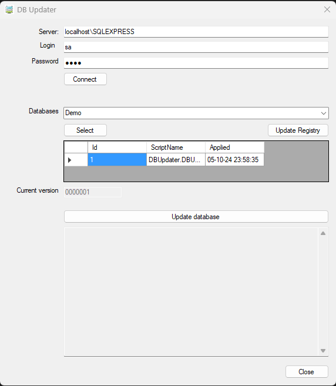

# DBUpdater

DBUpdater is a Windows Forms application built in VB.Net that allows users to connect to SQL Server databases, run database schema migrations using embedded SQL scripts, and save database connection settings to both the App.config file and the Windows Registry. The application also detects the highest version of SQL scripts and displays it.



## Features

- **SQL Server Connection**: Easily connect to a SQL Server by entering server details, login credentials, and selecting a target database.
- **Database Selection**: Filters and displays only user databases from the server (excludes system databases).
- **Schema Migration**: Uses [DbUp](https://dbup.github.io/) to execute embedded SQL scripts for database schema updates.
- **Script Versioning**: Automatically detects the highest script version from the embedded SQL files.
- **Config Persistence**: Stores server connection settings in `App.config` and the Windows Registry for quick access and configuration.

## Installation

1. Clone the repository:
    ```bash
    git clone https://github.com/your-username/DBUpdater.git
    ```

2. Open the solution in Visual Studio.

3. Restore the required NuGet packages, including DbUp.

4. Build the solution.

## Usage

### Running the Application

To run the application, open it from your build output folder or deploy it as needed. You can interact with the graphical interface to:

- **Connect to a SQL Server**: Enter the server, login, and password information.
- **Select a Database**: Choose a user database from the list of available databases.
- **Run Migration**: Click the "Run Migration" button to execute embedded SQL scripts.
- **Save to Registry**: Save server connection settings (server, database, login) to the Windows Registry.

## Embedded SQL Scripts

The application runs SQL migration scripts embedded in the executable. Scripts must follow a specific naming pattern: `DBU_<sequence number>-<description>.sql`, where `<sequence number>` is a zero-padded number (e.g., `DBU_0000001-Initial_Script.sql`). The application automatically detects and executes these scripts in order based on the sequence number.

## Logging

Migration and error logs are displayed in the application's interface and can be reviewed after running the migration.

## Configuration

### App.config

The application stores connection settings in the `App.config` file. To modify the settings, open the file and update the `appSettings` section:

```xml
<appSettings>
  <add key="Server" value="your-server"/>
  <add key="Login" value="your-login"/>
  <add key="Password" value="your-password"/>
</appSettings>
```

## Windows Registry
The application also supports saving connection settings to the Windows Registry under HKEY_CURRENT_USER\Software\SAM00\Database. Use the "Save to Registry" button to store the server, database, and login information.

## Prerequisites
- .NET Framework 4.7.2 or later
- SQL Server database

## Contributing
Feel free to contribute to the project by creating pull requests, reporting issues, or suggesting new features.

## License
This project is licensed under the MIT License.
